# Same ndv, different purity
## uniform purity

## zipf purity

# Same purity, different ndv
## uniform purity

## zipf purity

# Same purity, same ndv, different purity distribution

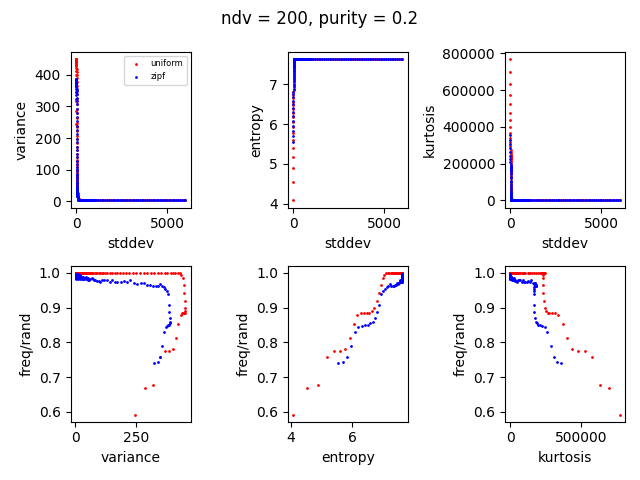

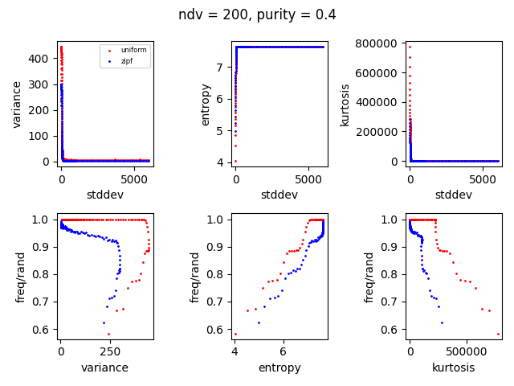

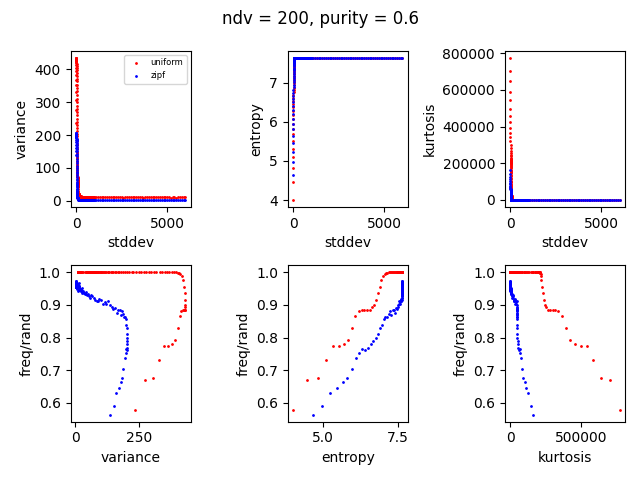

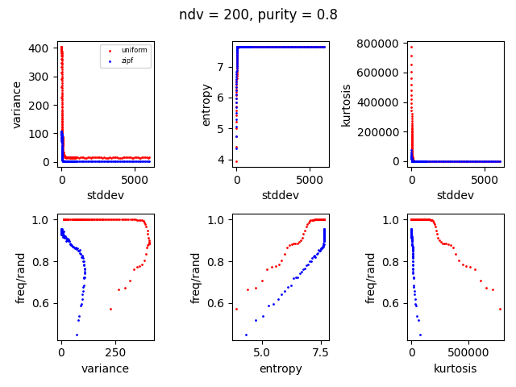

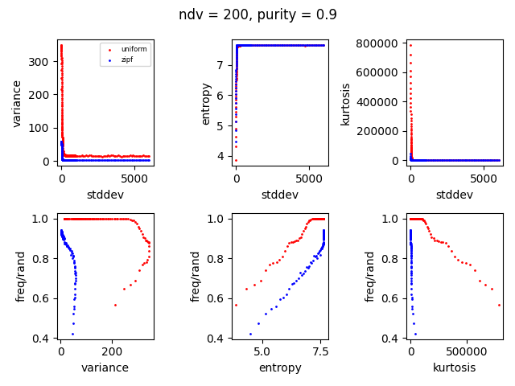

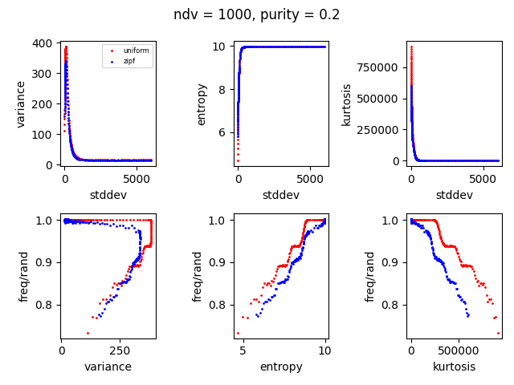

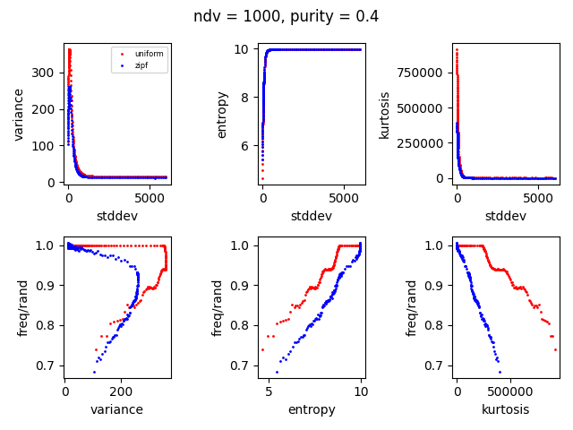

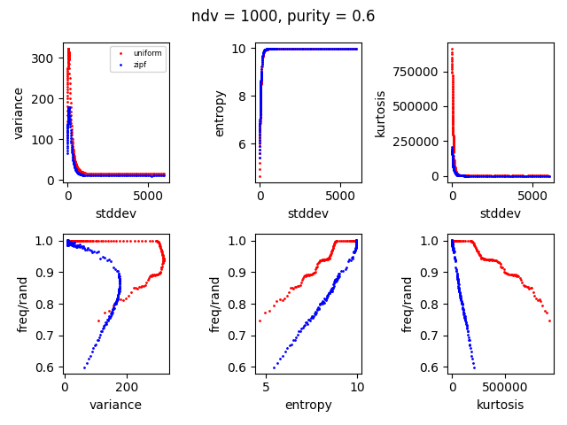

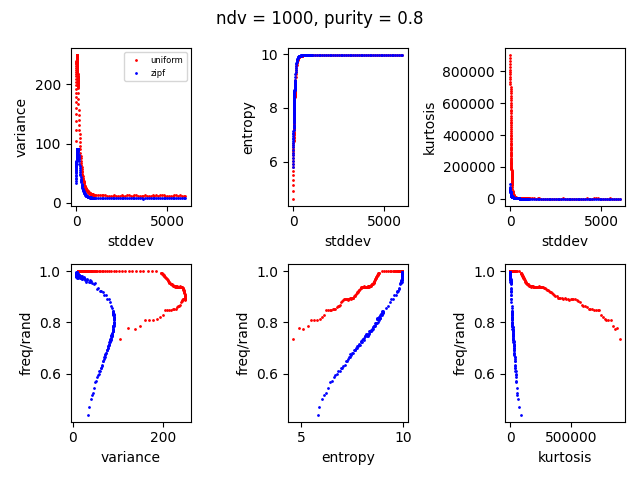

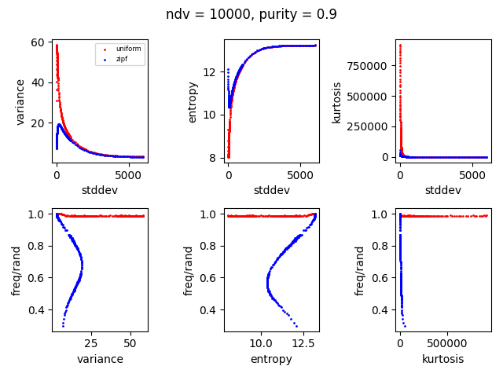

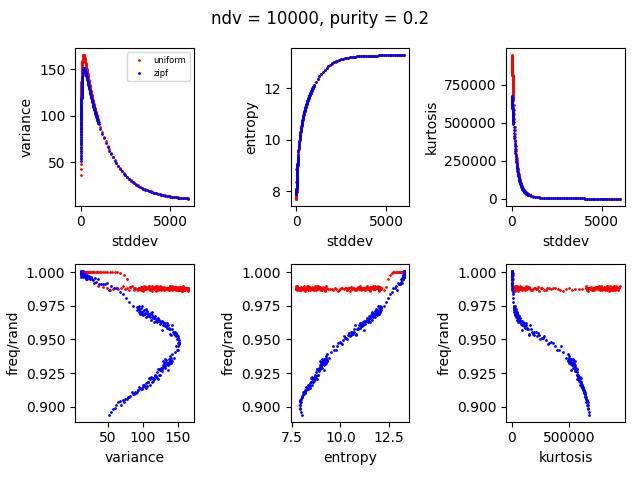

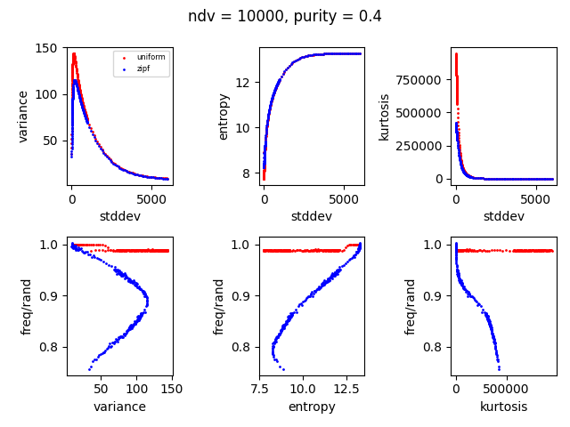

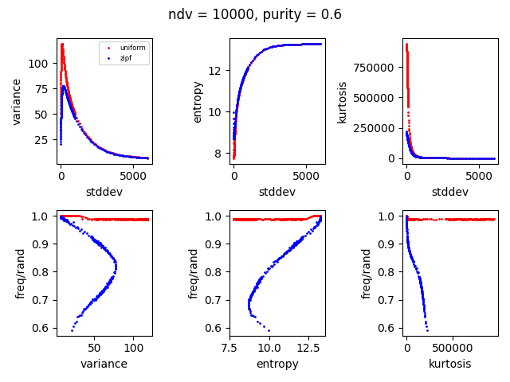

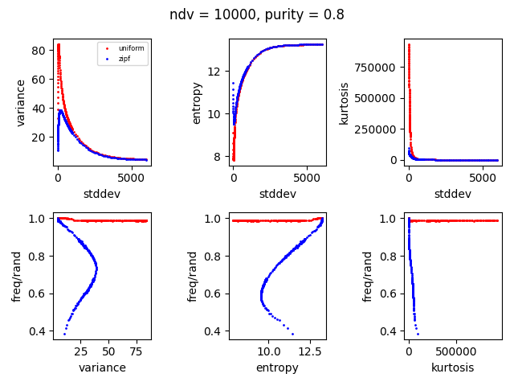

